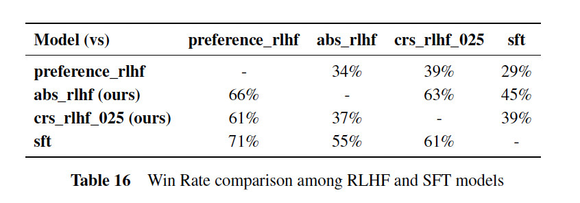

# Combined Preference-Based and Absolute Reward Signals for RLHF Fine-tuning
This repository contains the code and resources for my thesis on Reinforcement Learning from Human Feedback (RLHF) fine-tuning. The thesis was supervised by [Jun.-Prof. Dr. Dennis Riehle](https://www.uni-koblenz.de/de/informatik/iwvi/riehle/team/dennis-riehle) and [Anna Wolters, M.Sc.](https://www.uni-koblenz.de/de/informatik/iwvi/riehle/team/anna-wolters), and submitted to [The Institute of Information Systems](https://www.uni-koblenz.de/de/informatik/iwvi) at the University of Koblenz.

## Abstract

In the field of RLHF, the existing methods for fine-tuning center around a preference-based
reward model. While this approach is widely used, it lacks a global perspective on the quality of the individual samples. Since preference feedback is provided through pairwise comparison, it
can only offer relative information and does not account for the absolute quality of each
instance. This methodology, although practical, fails to measure how good or bad the examples
are, providing only an option to choose the best among the given and not
consider if all the given examples are of poor quality. To address these limitations, we trained the reward model directly using absolute feedback, which explicity learns from each response independently.

Motivated by the hypothesis that absolute rewards may offer a direct measure of response quality, which
could enable a more precise alignment of LLMs with human intention, this research
fills the gap by empirically investigating the impact of absolute reward signals on
RLHF fine-tuning for text generation.

This master's thesis explores the efficacy of incorporating absolute
reward signals into Reinforcement Learning from Human Feedback fine-tuning.
Furthermore, it study the trade-off between preference-based and absolute reward when combined. The investigation reveals that model trained with an absolute reward model
outperform those trained with a preference reward model. It found an inverse correlation
between the preference reward model's weight and performance when the reward scores of both
models are combined. The absolute reward model demonstrates better generalisability
over the preference reward model, highlighting its robust feedback mechanism
during fine-tuning. According to the experiments, the model fine-tuned with absolute and combined
reward signals achieved win rates of 66% and 63% respectively, outperforming models
fine-tuned solely with preference feedback.

## Result

### Reward models agreement with GPT4 

To evaluate the agreement of preference and absolute reward models with GPT4, we generate the responses using abs_rlhf and preference_rlhf model on final_eval dataset.
Then assign the feedback score on each response using both the reward models. Based on the feedback score we choose the winner according to absolute and preference reward model for all prompts, and compare it with GPT4 preference.

It reveals that the preference reward model performs better on OASST dataset with an agreement of 56% compared to 36% and 44% for helpful_base and koala datasets respectively.
On the contrary, the absolute reward model aligns better with GPT4 preference for helpful_base, koala, and vicuan with 60%, 72% and 64% respectively, compared to OASST dataset with 44% agreement.

This proves preference reward model specializes in OASST dataset and lacks generalization on other diverse datasets.


### Automated and Human Evaluation or RLHF models

**GPT4 annotation results:** Evaluation of rlhf models is conducted by generating the response on final_eval dataset and comparing the output of all the models among themselves.
As shown in Table 16 each model in the first column is compared with all the models in the first row using GPT4 annotators. The evaluation reveals all rlhf models are outperformed by sft (SFT baseline). However the crs_rlhf_025 and abs_rlhf beats the pre ference_rlhf model (RLHF baseline) with a win rate of 61% and 66% respectively.



**Human annotation results:** Similar to automated evaluation this stage also evaluated all models. However, it only evaluates 20 prompt responses generated using rlhf models and omits sft
due to the limitation of human annotators. As noted in Section 5.5, the stochastic nature of LLM text generation introduces variability. To mitigate this, we evaluate the model using three distinct sets of responses annotated by its corresponding annotation groups. The methodology for aggregating votes for each prompt, using the Borda count rank aggregation method is detailed in the ’Evaluation’ section.

we infer that participants in Group 2 and Group 3 successfully differentiated between the model’s generated response. Whereas Group 1 participant found responses from preference_rlhf and crs_rlhf equally good. This observed discrepancy can be accounted for variability in response as well as the subjectivity of each participant. The aggregated winning points for all models are 0.54, 0.79, and 0.66, with a corresponding standard deviation of 0.06, 0.058, and 0.029. Accordingly, the abs_rlhf model is ranked first, crs_rlhf second and prefrence_rlhf third.


Although abs_rlhf performs better compared to other rlhf model, it doesn’t show the same performance against the sft model. The performance of SFT is same or better than rlhf models,
rendering the need for RLHF approach useless. However, this observation doesn’t align with the work of Ouyang et al. (2022); Askell et al. (2021); Bai et al. (2022),
which already proves that RLHF produces better response compared to SFT. The discrepancy in our work could be due to the constraints enforced by our research and we assume if we re-train the models with more diverse data for multiple epochs then the rlhf model will perform better than the sft model.

## Conclusion
Our research reveals that rlhf models trained using absolute feedback generally perform better than the ones using preference feedback. While experimenting with difference
weight in CRS setting we found an inverse relation between weight and performance. As we increase the weight of preference feedback the model diverges away more and
more from the initial policy, which leads to poor performance. Although comparative analysis found abs_rlhf to be better than other rlhf models, it does not improve over the
sft model. Proving that RLHF doesn’t work within our defined constraint. 

In addition to that, both reward models were compared to examine their agreement against GPT4 preference. It reveals that the absolute reward model agrees with GPT4 more compared to
the preference reward model. It also shows that the absolute reward model learns features which help it to generalize well in comparison to the preference reward model even after
training on a dataset from the same distribution. This proves the absolute reward model to provide consistent and robust feedback during RL fine-tuning.

In conclusion, our research demonstrates the robustness and generalizability of absolute reward score when used for RLHF fine-tuning. Proving abs_rlhf to be superior to
prefrence_rlhf and marginally better than crs_rlhf , within our defined constraint. Our work highlighted drawback of preference reward model and successfully showed that absolute
reward model has good potential. This proves the potential of CRS feedback in RLHF fine-tuning when training on a more diverse dataset.

**P.S More Detail on Experiements Setup, Result and Discussion can be found in [Thesis doc](docs/CRS_RLHF_Thesis.pdf)**
## Data
This research mainly utilizes [Open Assistant](https://huggingface.co/datasets/OpenAssistant/oasst1) dataset for Supervised-Finetuning (SFT), Reward Modelling, and Reinforcement Learning (RL) fine-tuning.

## Setup
Make sure to choose the proper settings in the `config.yaml` file and install all requirements.
```bash
pip install -r requirements.txt
```

### Step 1: SFT
```bash
python sft_train.py --config_subset  sft --name_suffix _bs64_ep_1
```

### Step 2: Reward Modeling

For preference reward model training:
```bash
python rm_train.py --config_subset  rm --name_suffix _preference
```
Update the config and similarly train the Absolute reward model.

### Step 3: RL fine-tuning
```bash
python rl_train.py --config_subset  rl --name_suffix
```

Trained Lora adapters for [preference reward model](https://huggingface.co/alikhan0100u/Llama-2-7b-oasst-preference-reward-model-adapter) and [absolute reward model](https://huggingface.co/alikhan0100u/Llama-2-7b-oasst-abs-reward-model-adapter), along with all three RLHF (Abs_RLHF, Preference_RLHF, CRS_RLHF) models are available on [Huggingface](https://huggingface.co/alikhan0100u). Each RLHF model can be tested by generating response for 100 prompts from the [alpaca eval](https://huggingface.co/datasets/tatsu-lab/alpaca_eval) dataset using the script [rl_eval_pred.py](evaluations/rl_eval_pred.py) and then predicting reward score using the script [rl_eval_rewarding](evaluations/rl_eval_rewarding.py).

Result from automatic evaluation using GPT-4 can be found [here](alpaca_eval) and results from user-study can be found [here](evaluations/argilla_data). The results from our experiments are detailed further in the [documentation](docs)


## Acknowledgments and References
The training process of SFT and the reward model uses the Hugging Face's [Transformers](https://github.com/huggingface/transformers) library and follows the training procedure similar to the [Open Assistant](https://github.com/LAION-AI/Open-Assistant). For both models, our research substantially uses the code from Open Assitant and repurpose it for our specific use case. Whereas, RL fine-tuning utilizes the [TRL](https://github.com/huggingface/trl/tree/main) library and follows their training examples as a guide. Automated evaluation is done using [Alpaca eval](https://github.com/tatsu-lab/alpaca_eval/tree/main) library, whereas the portal for user-study was created using [Argilla](https://github.com/argilla-io/argilla).
